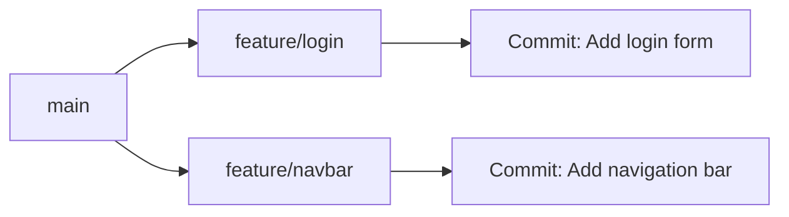

# Git Merge vs Rebase Tutorial

This repository explains the difference between `git merge` and `git rebase` using a simple role-play between two developers: Alice and Bob.

## The short version

- `git merge` combines branches and keeps the branch history intact.
- `git rebase` moves your branch commits onto the latest base branch, giving a cleaner, linear history.

## Role-play: Alice and Bob

Alice and Bob are working on the same project.

- Alice works on a feature branch called `feature/login`.
- Bob works on another feature branch called `feature/navbar`.
- Both branches start from the same `main` branch.

### Visual overview



### Initial state

```bash
git checkout main
git pull origin main

git checkout -b feature/login
git checkout main
git checkout -b feature/navbar
```

If your local repository still uses `master` as the default branch, rename it first:

```bash
git branch -m main
```

### Alice makes a change

```bash
git checkout feature/login
# add login form

git add .
git commit -m "Add login form"
```

### Bob makes a different change

```bash
git checkout feature/navbar
# add navigation bar

git add .
git commit -m "Add navigation bar"
```

At this point, both branches have different commits based on the same `main` history.

## Example 1: Git merge

Alice and Bob both start from the same `main` branch. Bob wants to include the newest updates from `main` before he shares his work.

```bash
git checkout feature/navbar
git merge main
```

Now Bob can merge his finished branch back into `main`:

```bash
git checkout main
git merge feature/navbar
```

### What happens?

- A merge commit is created.
- The history shows that two branches were combined.
- This is good when you want to preserve the fact that work happened in parallel.

### Merge result

```text
A---B---M   main
     \ /
      C---D feature/navbar
```

## Example 2: Git rebase

Bob can also replay his commits on top of the latest `main` branch instead of creating a merge commit:

```bash
git checkout feature/navbar
git rebase main
```

Then he fast-forwards `main`:

```bash
git checkout main
git merge feature/navbar
```

### What happens?

- Bob's commits are replayed as if they were created after the latest `main` changes.
- The history stays linear and tidy.
- This is useful when you want a cleaner commit history.

### Rebase result

```text
A---B---C'---D'   main
```

## Alice and Bob in plain language

Alice says:

> "I want to keep the branch history visible so everyone can see the work happened in parallel."

Bob says:

> "I want a cleaner history, so I will rebase my work onto the latest `main`."

## When to use each

Use `git merge` when:

- You want to preserve the branch history.
- You are working in a shared team environment and want a clear record of parallel work.

Use `git rebase` when:

- You want a clean, linear history.
- You are working on a feature branch and want to update it before merging.

## When to use rebase --onto

Git does not have a `--into` flag. The command you want is `git rebase --onto`.

Use `git rebase --onto` when you want to move a branch onto a different base branch and replay only the commits that belong to that branch.

This is useful when:

- your feature branch was created from an older version of `main`
- `main` has moved forward since then
- you want to change the branch's starting point without keeping the old base history

### Example

```bash
git checkout feature/login
git rebase --onto main <old-base> feature/login
```

In this command:

- `main` is the new base branch
- `<old-base>` is the commit where your branch used to start from the old base
- `feature/login` is the branch whose commits will be replayed

A simple way to find the old base is:

```bash
git merge-base main feature/login
```

Then you can run:

```bash
git rebase --onto main <old-base> feature/login
```

In plain English, this says: “take the commits from `feature/login` that are not in `<old-base>`, and replay them on top of `main`.”

Use `--onto` when you want to move a branch to a new parent branch, especially when the branch should not keep the old branch history attached to it.

## Important warning

Rebasing rewrites commit history. Do not rebase commits that other people already pushed and are using.

## Quick cheat sheet

### Merge

```bash
git checkout feature/navbar
git merge main
```

```bash
git checkout main
git merge feature/navbar
```

### Rebase

```bash
git checkout feature/navbar
git rebase main
```

```bash
git checkout main
git merge feature/navbar
```

### When to use which

- Use `merge` when you want to preserve branch history and show parallel work.
- Use `rebase` when you want a clean linear history before merging.

## Summary

- `merge` = combine and preserve history.
- `rebase` = replay and rewrite history for a cleaner line.
